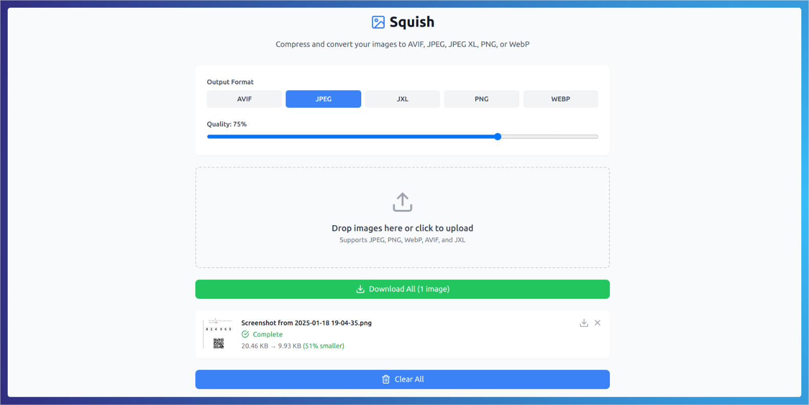
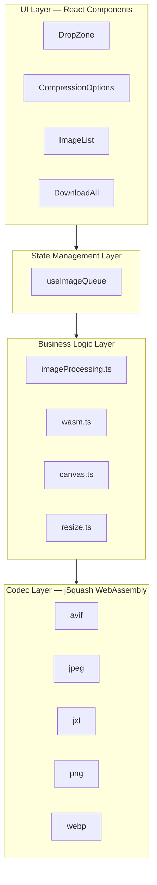
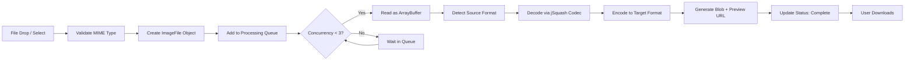

<div align="center">
  <p>
    <h3>
     Squish - Modern Image Compression Tool
    </h3>
  </p>

<a href="https://squish.tofi.pro">
  
</a>

  <p></p>


[](https://opensource.org/licenses/MIT)

</div>

## Introduction

**Squish** is a browser-based image compression tool engineered to deliver high-performance optimization entirely on the client side, without transmitting files to any external server. The application leverages WebAssembly codecs through the [jSquash](https://github.com/jamsinclair/jSquash) library, enabling native-speed encoding and decoding directly within the browser runtime.

The tool supports five industry-standard image formats — AVIF, JPEG via MozJPEG, JPEG XL, PNG via OxiPNG and WebP — and exposes granular quality controls per format, batch processing capabilities and real-time compression statistics through an intuitive drag-and-drop interface.

A live instance is available at [squish.tofi.pro](https://squish.tofi.pro).

## Features

- **Multi-Format Compression**: full encoding and decoding support for AVIF, JPEG, JPEG XL, PNG and WebP, each powered by dedicated WebAssembly modules.
- **Client-Side Processing**: all compression operations execute in the browser, ensuring that no image data leaves the user's device at any point.
- **Smart Queue System**: a parallel processing queue with a concurrency limit of three simultaneous operations prevents browser resource exhaustion during large batch workloads.
- **Batch Processing**: multiple images can be uploaded, compressed and downloaded in a single workflow.
- **Format Conversion**: images can be transcoded from any supported source format to any supported target format.
- **Per-Format Quality Control**: adjustable quality settings for lossy formats, with PNG operating in lossless mode exclusively.
- **Real-Time Preview**: compressed image previews and size reduction statistics are rendered as each file completes processing.
- **Drag and Drop Interface**: native HTML5 drag-and-drop with file type validation for seamless image ingestion.
- **Dark Mode**: theme switching support via system preference detection and manual toggle.

## Architecture

Squish follows a component-based architecture built on React 18 with TypeScript in strict mode, organized into four clearly delineated layers.



The **UI Layer** comprises React components responsible for presentation: `DropZone` handles file ingestion, `CompressionOptions` manages format selection and quality adjustment, `ImageList` renders processing status per image, and `DownloadAll` enables batch downloads.

The **State Management Layer** centralizes orchestration through the `useImageQueue` hook, which implements a queue-based parallel processing strategy. This hook tracks processing state via refs rather than React state to avoid unnecessary re-renders during high-throughput operations.

The **Business Logic Layer** encapsulates encoding, decoding, WASM module initialization, canvas manipulation and image resizing as pure utility functions, decoupled from any UI concern.

The **Codec Layer** consists of five jSquash WebAssembly packages, each wrapping a production-grade compression library: libavif for AVIF, MozJPEG for JPEG, libjxl for JPEG XL, OxiPNG for PNG and libwebp for WebP.

## Compression Pipeline

The following diagram illustrates the complete lifecycle of an image from ingestion to download.



Upon file ingestion, the `DropZone` component validates MIME types and, for JPEG XL files, performs an additional extension-based check given the limited browser MIME support for this format. Each validated file is wrapped in an `ImageFile` object with a unique identifier, original size metadata and a `pending` status.

The `useImageQueue` hook then orchestrates processing. A `requestAnimationFrame` call ensures the UI renders the pending state before compression begins, preventing visual freezing during large uploads. The queue enforces a maximum of three concurrent operations, processing additional files as slots become available.

Each image traverses a decode-then-encode pipeline: the source file is read as an `ArrayBuffer`, decoded to raw `ImageData` using the appropriate jSquash codec, then re-encoded to the target format with the user-specified quality settings. The resulting compressed `Blob` and its corresponding Object URL are stored in state, and the image status transitions to `complete`.

## Default Quality Settings

| Format  | Default Quality | Compression Mode |
|---------|:--------------:|------------------|
| AVIF    | 50%            | Lossy, effort level 4 |
| JPEG    | 75%            | Lossy via MozJPEG |
| JPEG XL | 75%            | Lossy |
| PNG     | —              | Lossless via OxiPNG |
| WebP    | 75%            | Lossy |

## Technology Stack

Squish is built on a carefully selected set of modern web technologies.

- **React 18** with **TypeScript 5** in strict mode for the application foundation.
- **Vite 5** as the build tool, with jSquash packages excluded from dependency optimization to preserve proper dynamic WASM imports.
- **Tailwind CSS 3** for utility-first styling, complemented by **shadcn/ui** components built on **Radix UI** primitives.
- **Lucide React** for the icon system.
- **next-themes** for dark mode support with class-based toggling and system preference detection.
- **clsx** and **tailwind-merge** for conditional class name composition.

## Project Structure

```
squish/
├── src/
│   ├── components/
│   │   ├── CompressionOptions.tsx
│   │   ├── DropZone.tsx
│   │   ├── ImageList.tsx
│   │   ├── DownloadAll.tsx
│   │   └── providers/
│   │       └── theme-provider.tsx
│   ├── hooks/
│   │   └── useImageQueue.ts
│   ├── ui/
│   │   ├── button.tsx
│   │   ├── card.tsx
│   │   └── slider.tsx
│   ├── utils/
│   │   ├── imageProcessing.ts
│   │   ├── wasm.ts
│   │   ├── formatDefaults.ts
│   │   ├── download.ts
│   │   ├── canvas.ts
│   │   └── resize.ts
│   ├── types/
│   │   ├── encoders.ts
│   │   └── types.ts
│   ├── App.tsx
│   ├── main.tsx
│   └── index.css
├── public/
├── vite.config.ts
├── tsconfig.json
├── tailwind.config.js
└── package.json
```

## Getting Started

### Prerequisites

- Node.js 18 or later
- npm 7 or later

### Installation

1. Clone the repository:

```bash
git clone https://github.com/geo-mena/squish.git
cd squish
```

2. Install dependencies:

```bash
npm install
```

3. Start the development server:

```bash
npm run dev
```

4. Build for production:

```bash
npm run build
```

## Usage

1. **Drop or Select Images**: drag and drop images onto the upload area or click to select files from the file system.
2. **Choose Output Format**: select the desired target format among AVIF, JPEG, JPEG XL, PNG or WebP.
3. **Adjust Quality**: use the quality slider to calibrate the balance between file size and visual fidelity. This control is disabled for PNG, which operates in lossless mode.
4. **Download**: retrieve individual compressed images or use the batch download function to export all completed files.

## Contributing

Contributions are welcome. Please open an issue first to discuss proposed changes before submitting a Pull Request.

1. Fork the repository
2. Create your feature branch: `git checkout -b feature/AmazingFeature`
3. Commit your changes: `git commit -m 'Add some AmazingFeature'`
4. Push to the branch: `git push origin feature/AmazingFeature`
5. Open a Pull Request

## License

This project is licensed under the MIT License. See the [LICENSE](LICENSE) file for details.

## Acknowledgments

- [jSquash](https://github.com/jamsinclair/jSquash) for the WebAssembly image codec implementations
- [MozJPEG](https://github.com/mozilla/mozjpeg) for JPEG compression
- [libavif](https://github.com/AOMediaCodec/libavif) for AVIF support
- [libjxl](https://github.com/libjxl/libjxl) for JPEG XL support
- [OxiPNG](https://github.com/shssoichiro/oxipng) for PNG optimization
